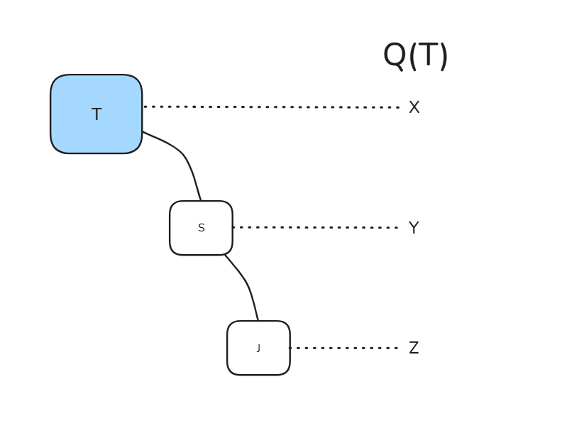

# Liskov-Substitution Principle (LSP)
### Princípio da Substituição de Liskov

Definição clássica: 

    Se j(x) é uma propriedade demonstrável dos objetos x de tipo T, então j(y) deve ser verdadeiro para objetos y de tipo S, onde S é um subtipo de T

O principio da substituição de Barbara Liskov diz que se existe um método que recebe do tipo T e funciona normalmente, portanto deve funcionar para y, sendo y uma instancia de S que é um subtipo de T. Portanto, o comportamento pode ser alterado, mas não deve deixar de existir. Da mesma forma deve se manter funcionando para k instancia de J sendo um subtipo de S.
- Subtipo não pode quebrar contratos do tipo base
- Não pode restringir pré-condições
- Não pode enfraquecer pós-condições
- Não pode lançar exceções inesperadas



```cs
public static class Classe
{
    public static void q(T t)
    {
        // ...
    }
}
public class T{}
public class S : T{}
public class J : S{}
```

Exemplo para a aula: Ave -> Calopsita e Penguin

```cs
Console.WriteLine("Hellos, world!");

var x = new T();
Classe.q(x); // deve funcionar normalmente

var y = new S();
Classe.q(y); // deve funcionar normalmente

var z = new J();
Classe.q(z); // deve funionar normalmente
```

** A Classe.q não precisa saber quem está chegando, ela apenas confia que qualquer um daquela linhagem sabe se comportar.