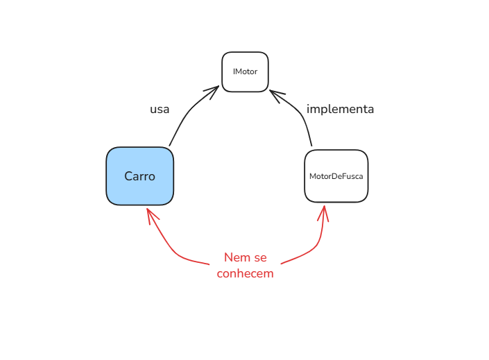

# Dependency Inversion Principle (DIP)
### Principio de Inversão de Depêndencia

Definição clássica:

    Módulos de alto nível não devem depender de módulos de baixo nível. Ambos devem depender de abstrações

Uma classe de alto nível não deve depender diretamente de uma classe de baixo nível concreta, ou seja, Dependa de abstrações (interfaces), não de implementações (classes concretas).   

