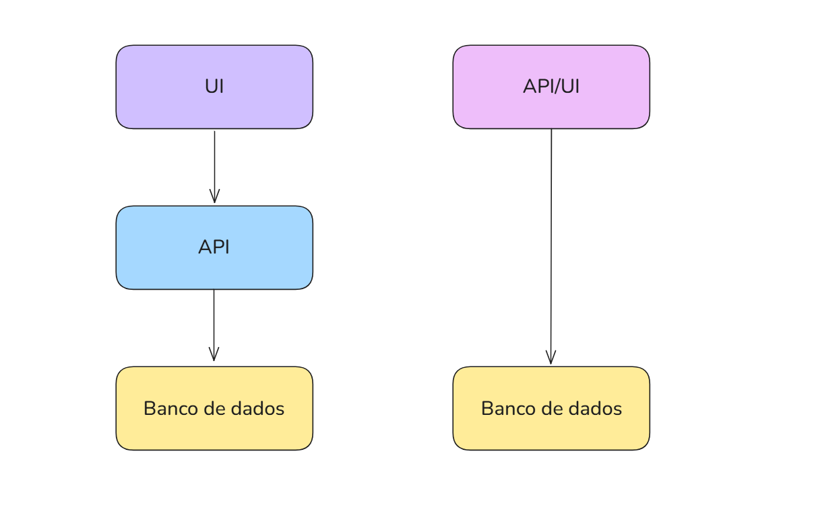

# Monolito

Monólito é uma aplicação onde todo o sistema está dentro de uma única unidade de deploy: 
- interface do usuário 
- regras de negócio 
- controle
- acesso a dados
- integrações

Todas essas partes são executadas juntas, geralmente em um único processo, e publicadas 
como uma única aplicação.

Isso faz com que, ao modificar qualquer parte do sistema, seja necessário realizar o 
deploy completo novamente, mesmo que a alteração seja pequena.

(isso é o que fazemos e o que vocês tem visto até então)

