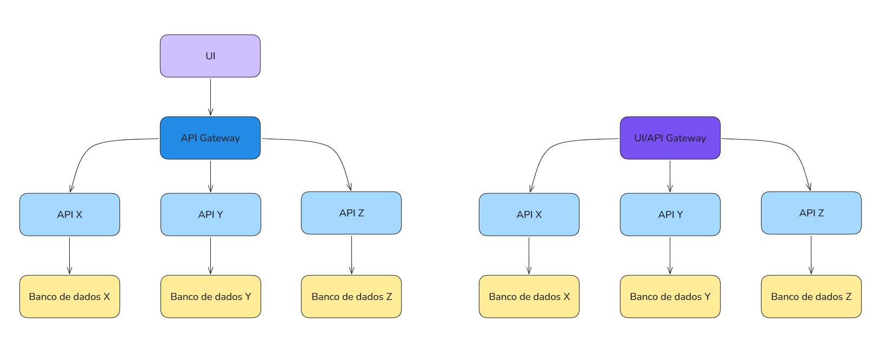
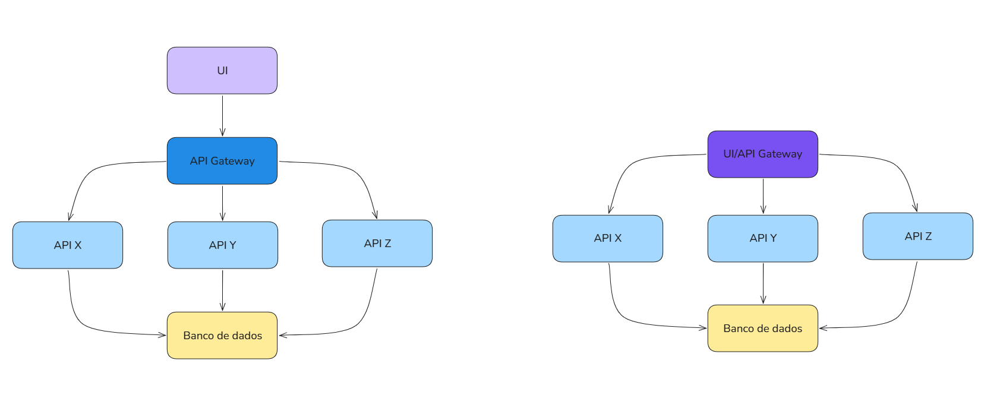

# Micro Serviços

Micro Serviços operam de uma maneira um pouco diferente do que estão
acostumadas, um único micro serviço é como se fosse uma parte da aplicação
que funciona de maneira independente, digamos que temos uma aplicação de 
clientes e produtos, se fossemos desenvolver com micro serviços, teriamos
uma aplicação para cada responsabilidade:

API Clientes
API Produtos
API Pedidos
API Entregas

Cada uma dessas APIs opera de modo independente, tem seu próprio deploy,
sua própria database, elas até podem compartilhar o mesmo servidor do banco de dados,
em teoria até a mesma database, mas pelo menos em schemas diferentes e NUNCA 
dois micro serviços acessando a mesma tabela. 

Isso permite que cada parte da aplicação geral evolua e seja desenvolvida separadamente.

Isso resulta em que conceito que vimos anteriormente?

---
---
- coesão (cada serviço tem responsabilidade clara)
- SRP em nível de sistema
- OCP (adicionar serviço sem alterar outros)
- DIP (comunicação por contratos/API)
---
---

BFF | Backend for Frontend - Quando um backend gateway é especifico para um frontend:
Web UI     -> BFF Web
Mobile App -> BFF Mobile
Admin UI   -> BFF Admin 

- toda API pode ser reutilizada -> sim
- mas se ela modela dados para uma UI -> BFF
- se só repassa chamadas -> gateway genérico

Cada BFF:
- agrega múltiplos micro serviços
- adapta dados para a UI específica
- evita que o frontend conheça todos os serviços
- reduz acoplamento entre frontend e micro serviços