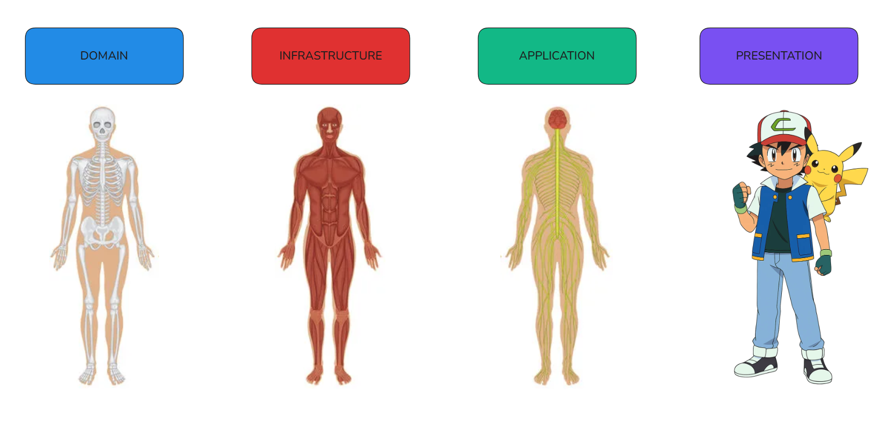
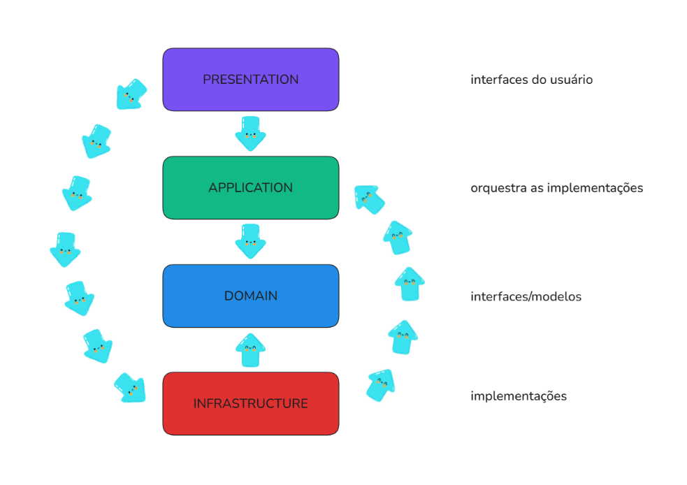
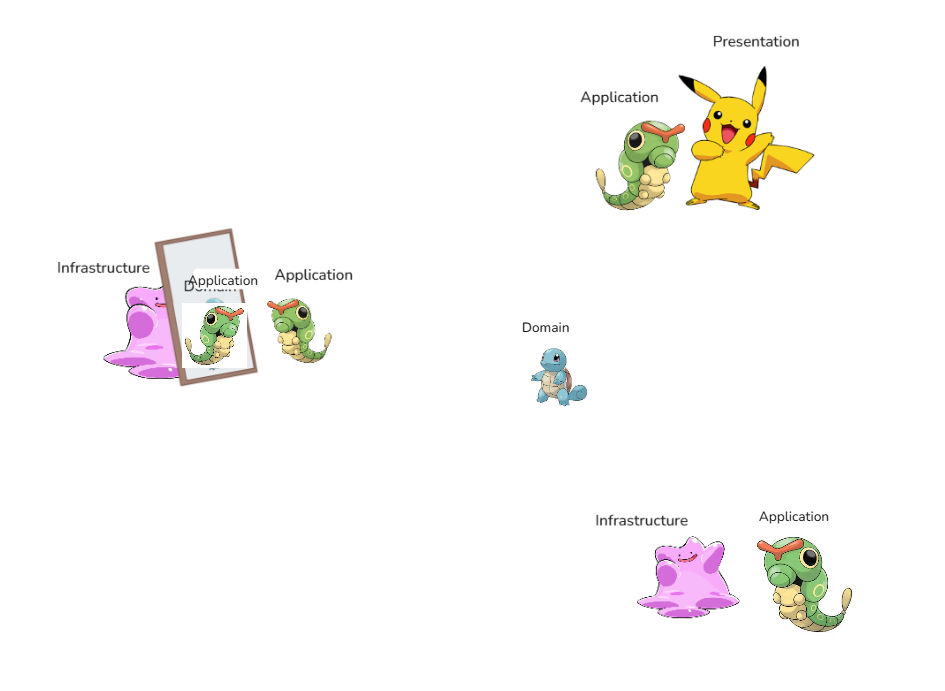

# Camadas Clássicas

### Presentation
Interface do usuário, onde consome o esqueleto desenvolvido para apresentar ao usuário de forma agradávelac

### Application
Responsável por orquestrar os fluxos do sistema, coordenando regras de negócio, permissões e comunicação entre domínio e infraestrutura

### Domain
Contém a estrutura e a regra de negócio, onde é definido o escopo do projeto

### Infrastructure
Responsável por processar os dados, implementar técnica do sistema, interagir com o banco de dados

---

### Sobre services
Serviços sobre a lógica do funcionamento são que chamamos de 'Serviços de Infraestrutura', eles tem sua interfaces na Application e sua implementação na Infrastructure

Serviços puros ligados diretamente a regra de negócio do projeto são o que chamamos de 'Domain Services', que não dependem de interfaces, eles são responsáveis por conter lógicas complexas

### ⚠️ Mão debilitada, texto alto em IA (não aguento mais digitar com a esquerda) ⚠️

### Onde devem ficar as regras de negócio?

| Camada | Tipo de Regra | Exemplo Prático |
| :--- | :--- | :--- |
| **Domain (Entidade)** | **Invariantes de Negócio:** Regras essenciais que definem a existência do objeto. | "Um usuário não pode ter idade negativa" ou "O e-mail deve conter '@'". |
| **Domain (Service)** | **Regras Multi-Entidade:** Lógicas complexas que envolvem a interação entre dois ou mais modelos. | "Para transferir dinheiro, a conta A precisa de saldo e a conta B precisa estar ativa". |
| **Application (UseCase)** | **Regras de Orquestração:** Regras de fluxo, permissões de sistema e integração de serviços. | "Se o usuário for menor de idade, bloquear o cadastro e disparar um log para o admin". |
---