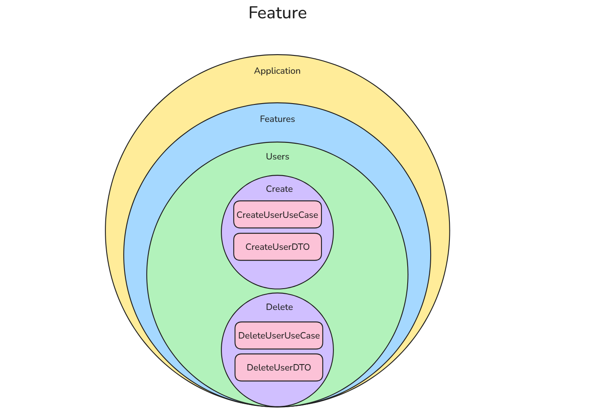

# Fluxo

## UseCase, Handler e Feature
Estes 3 são frequentemente usados para se referir a mesma coisa, mas aqui 
vamos entender a diferença entre eles e a importância de cada um

#### Feature
Feature é um padrão organizacional, onde dividimos por contexto, e cada 
contexto guarda suas features (create, update, getby__, login, auth), e 
dentro de sua feature já estão todos os arquivos necessários para seu 
funcionamento

#### UseCase
UseCases é um padrão onde removemos a responsabilidade do Controller de ter que
gerenciar o fluxo, receber e processar requisições e devolver respostas, tudo isso 
sozinho, com o UseCase deixamos para o Controller apenas a portaria da API e o dever
de responder quem mandou a requisição, o processamento é escondido por de baixo de um
UseCase.
O caso de uso é onde orquestramos o funcionamento das atividades implementadas em cada
serviço

    Controller -> UseCase -> Service -> DbContext

#### Handler
Basicamente a mesma coisa que o UseCase :)
    
    Controller -> Handler -> Service -> DbContext

Ambos existem para poder separar responsabilidades da maneira que achar melhor, se 
houver um processo técnico na API que precisa ser realizada antes do processamento dos
dados você pode escolher implementar um dos dois primeiro para então chamar o segundo,
servem como um leque para organização:

    Controller -> Handler -> UseCase -> Service -> DbContext
    Controller -> UseCase -> Handler -> Service -> DbContext

## Projetos BDO
Atualmente nas aplicações BDO está sendo utilizado Handlers

## UseCases x Services
#### UseCase
Representa uma intenção do usuário, valida se o usuário pode fazer aquilo. O UseCase 
não sabe como fazer algo, mas ele sabe o que tem que ser feito e quando tem que ser 
feito.

#### Service
É um conjunto segregado de métodos que realizam operações técnicas robustas que não
cabem dentro de uma entidade diretamente, como visto anteriormente pode-se ter os
Domain Service e os Infrastructure Services. Ou seja, services realizam tarefas 
especificas, para então o UseCase uni-las e montar uma operação maior

## * Simplicidade sustentável *