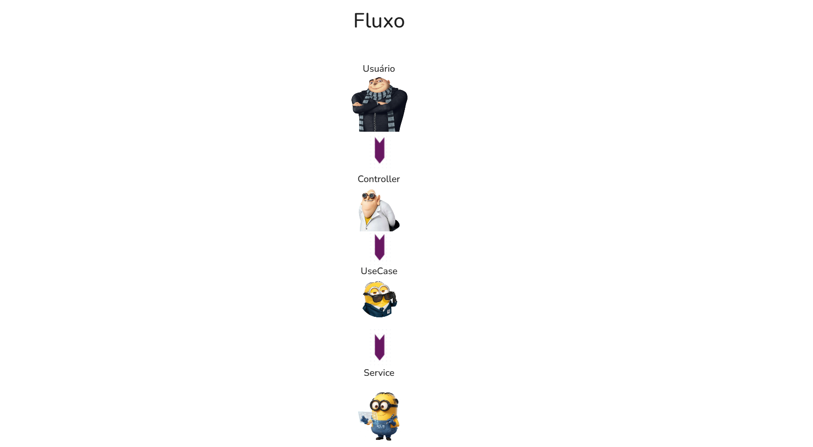
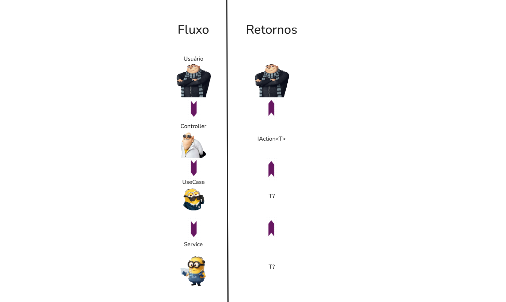
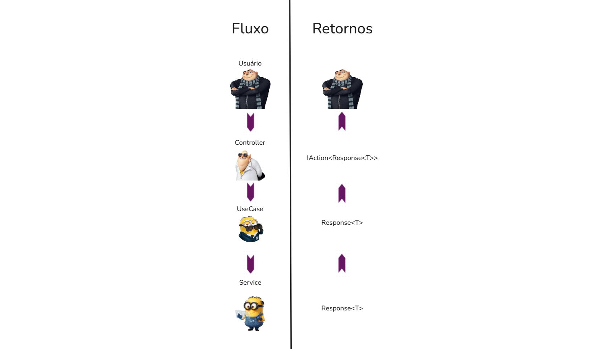

# Response Pattern

    
Vamos pensar a respeito de como realizamos o fluxo de operações dentro da nossa API:

Vamos supor que estamos fazendo um getAll para listar os planos malignos do Gru (ex: roubar a Lua)
filtrando por estado (concluido, pendente, em andamento, atrasado), um plano tem os seguintes campos:
- Id (int)
- Nome (string)
- Data de execução (DateOnly)
- Descricao (string)
- Estado (string)
- Quantidade necessária de minions (int)
- Passo a passo de como executar o plano (informação confidencial, string)

(use o quadro para ir anotando, montar DTO também)

    Debatam sobre o que cada etapa deve fazer.
---
    Nossa API valida os erros, portanto caso seja enviado um estado que não existe, onde o erro deve ser validado?
Não é legal estourarmos um erro dentro da aplicação, isso geraria Internal Server 
Error (status code 500), para uma situação de Bad Request (status code 400) 

---
    Agora que tratamos erros, de que forma isso impacta o retorno dos tipos de dados de cada etapa?
---
Possível solução:

---
    O que pode ser feito para resolver esse problema?

---

#### Response Pattern:
Vamos desenvolver um objeto para retorno, para podermos controlar completamente
o que está ocorrendo durante o fluxo do sistema:

