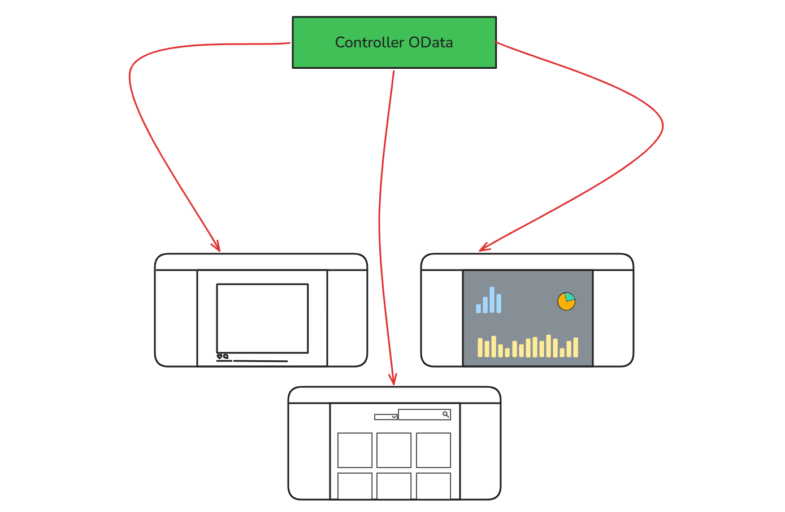
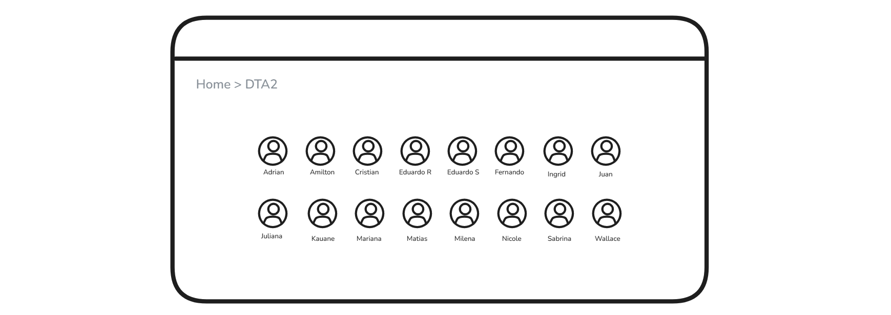
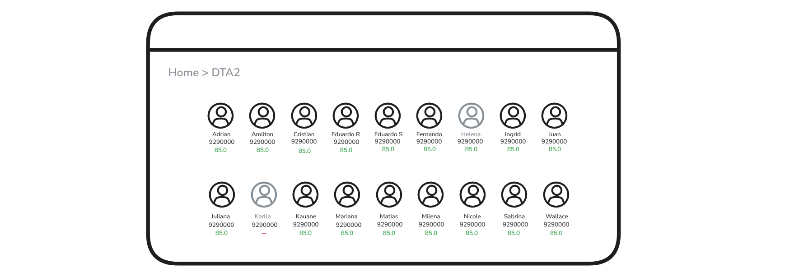

# OData

O BDO utiliza um padrão um pouco diferente do que acabamos de ver, eles
fazem uso de um método chamado OData.

OData é uma maneira de realizar queries através de endpoints, isso aumenta
a eficiência do processo de desenvolvimento, já que com isso podemos utilizar 
o mesmo endpoint para diversas situações, mas isso faz com que a abordagem 
que tratamos anteriormente mude um pouco.

Como OData é feito para ser reaproveitado, nosso retorno precisa ser mais 
recheado, para poder ser usado em mais situações, diferente do que discutimos
antes sobre precisarmos fazer retornos simples e direto ao ponto.

Vamos entender melhor:

Um Controller que utilzia OData precisa ter dados versáteis para diversos 
tipos de uso, contendo mais dados do que para apenas um caso único.


### Como OData funciona
OData trabalha com base no retorno do controller, o Controller entrega para o front-end 
um objeto IQueryable<T> ou SigleResult<T>, ou seja, um objeto que pode ser selecionado, 
pode ser filtrado, pode ser **analisado**, nós controlamos o tipo de dados que serão 
passados para a análise. 

---
Digamos que queremos gerenciar aprendizes, notas e aniversariantes, e temos um modelo:
```cs
public class User
{
    int Id {get;set;}
    string Name {get;set;}
    string UrlPicture {get;set;}
    DateOnly Birth {get;set;}
    string EDV {get;set;}
    float Grade {get;set;}
    string Password {get;set;}
}
```


Mas ainda precisamos definir bem as responsabilidades de cada endpoint, aquele que é 
utilizado para uma tela que o usuário acessa talvez não seja o mesmo para o que o administrador 
acessa.

No exemplo a cima um aprendiz acessa uma página que mostra sua turma e todos os seus colegas, porém
ele não deve ter acesos a nada mais além disso:
- Nome
- Foto

Outros dados além desse vamos considerar como sensíveis:
- EDV
- Data de nascimento
- Média de notas
- Senha

Por outro lado quando temos um instrutor listando os aprendizes temos acesso a novas informações,
como:
- EDV
- Média geral
- Alunas arquivadas


Se não separarmos a responsabilidade em diferentes Controllers, e utilizar o mesmo endpoint para
ambas as telas, um aprendiz mal intencionado poderia fazer manualmente uma requisição pela URL
selecionando os dados desejados, e com isso conseguir ver a nota de todos da turma.

    Para solucionar o problema dessas duas telas usarem o mesmo endpoint, como podemos resolver?

- Separar responsabilidades entre endpoints
- Criar DTOs específicos para cada contexto
- Aplicar autorização corretamente
- Evitar expor propriedades sensíveis desnecessariamente


Com um DTO especifico criado para o caso da página do Aprendiz, caso ele tente forçar selecionar
todos os aprendizes com sua nota vai resultar em um erro, uma vez que a propriedade não existe 
nos objetos retornados para análise